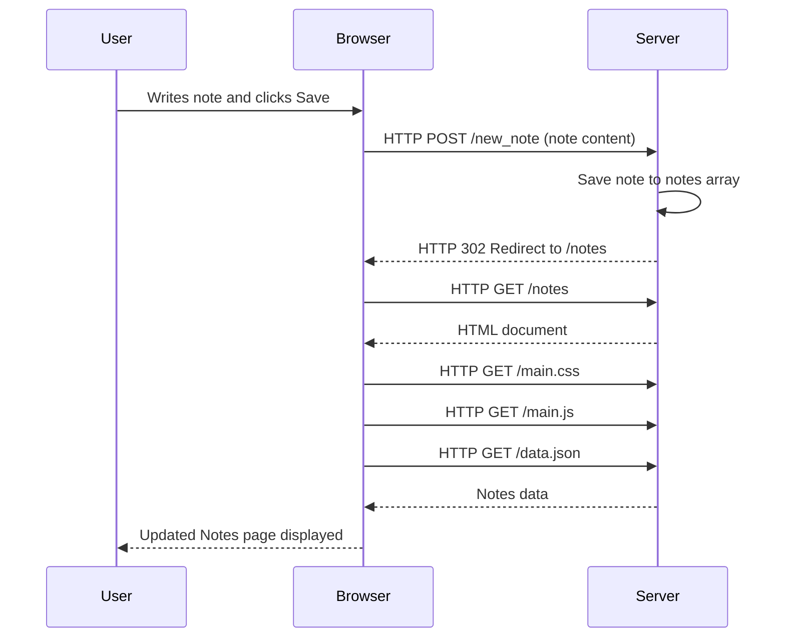

```mermaid
sequenceDiagram
    participant User
    participant Browser
    participant Server

    User->>Browser: Writes note and clicks Save
    Browser->>Server: HTTP POST /new_note (note content)
    Server->>Server: Save note to notes array
    Server-->>Browser: HTTP 302 Redirect to /notes
    Browser->>Server: HTTP GET /notes
    Server-->>Browser: HTML document
    Browser->>Server: HTTP GET /main.css
    Browser->>Server: HTTP GET /main.js
    Browser->>Server: HTTP GET /data.json
    Server-->>Browser: Notes data
    Browser-->>User: Updated Notes page displayed
```
