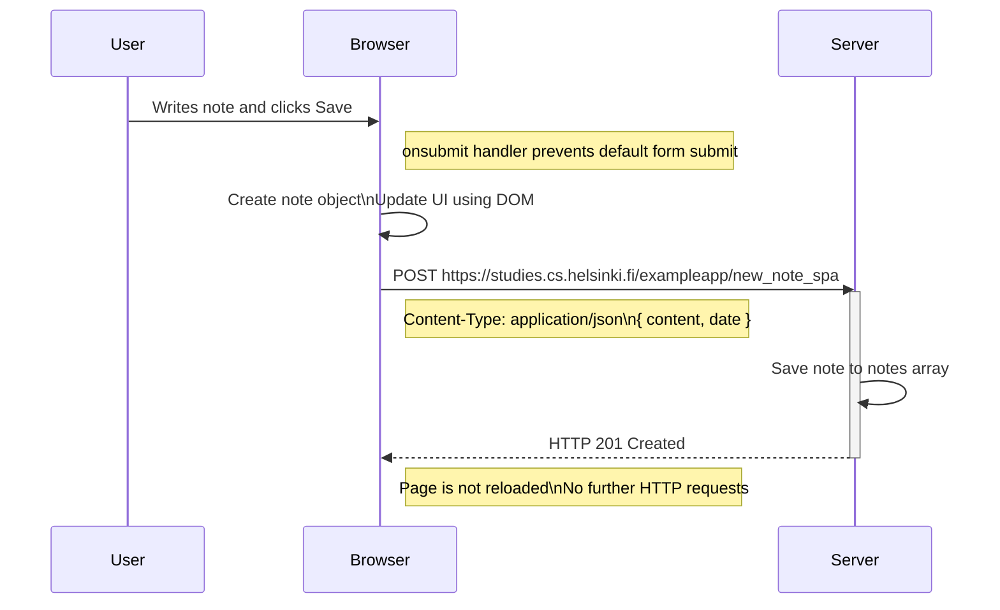

```mermaid
sequenceDiagram
    participant User
    participant Browser
    participant Server

    User->>Browser: Writes note and clicks Save
    Note right of Browser: onsubmit handler prevents default form submit

    Browser->>Browser: Create note object\nUpdate UI using DOM
    Browser->>Server: POST https://studies.cs.helsinki.fi/exampleapp/new_note_spa
    activate Server
    Note right of Browser: Content-Type: application/json\n{ content, date }

    Server->>Server: Save note to notes array
    Server-->>Browser: HTTP 201 Created
    deactivate Server

    Note right of Browser: Page is not reloaded\nNo further HTTP requests

```
